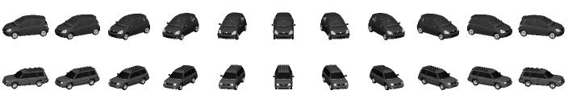

## Convert 'docx' into 'txt'

  1. Install the package "docx"

      pip install python-docx

  2. Run 'batch_proc_doc.py'
      
      It will convert docx files in 'docxs' to txt in 'txt_docx'

## Convert 'xls' into 'txt'

  1. Install the package "xlrd"

  2. Run 'batch_proc_xls.py'
  
      It will convert xls files in 'xls' to txt in 'txt_xls'

## Load and save 3D views as images

  1. Install the package "cv2"
  
  2. Run '3D_views.py'
      It will load 3D models in 'cars', and save their selected views as images in 'cars_views'
      
      

## Unsupervised text summarization based on word2vec    
  Idea: (1) Construct a vocabulary: Collect all the words and remove the stopwords; (2) Construct the vector representations from Google's word2vec for the words in this vocabulary, to speed up next step.
  (3) Compute the mean mu of word2vec for one entire document. Obtain the "sentences" of the document with a sliding window, and compute the mean of word2vec for each sentence. The summarization is considered as the sentence whose word2vec mean is closest to the entire document.

  1. Download the word2vec vectors (i.e. GoogleNews-vectors-negative300.bin file) from https://code.google.com/p/word2vec/. Put this binary file into the current directory.
  2. Run 'batch_summarize_word2vec'
  
        It will summarize each txt in 'txt_summ/txt_all' to as short text in a pre-defined-size window
